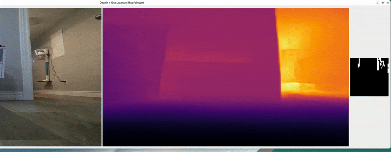

# OpenCV Testing

This folder contains experimental scripts and prototypes for testing various OpenCV-based vision techniques for the DriveCore Project.

The purpose of this directory is to quickly iterate on different ideas, including:
- Floor detection
- Obstacle detection
- Simulated depth estimation
- Path planning
- Contour tracking
- Kalman filtering
- Other computer vision utilities

Each script is treated as a standalone experiment or iteration, with its purpose, techniques, and results noted below.

---

## Iteration Notes

### Iteration 01 - `pathDetectT1.py`
- **Goal:** Automatically isolate the most drivable flat surfaces and map a path (curve).
- **Technique:** Sampling using a predefined color array.
- **Result:** Subpar outlining of the floor/surface.
<details>

<summary>GUI Demo 01:</summary>


</details>

### Iteration 02 - `pathDetectT2.py`
- **Goal:** Automatically isolate the most drivable flat surfaces, map a path (curve), and sample the floor automatically. 
- **Technique:** Use a box on the lower portion of the screen to sample the HSV values of the floor. Applied Kalman Path Smoothing.
- **Result:** Clean, predictive path useful for motion planning, and the addition of HSV sliders.
<details>

<summary>GUI Demo 02:</summary>


</details>

### Iteration 03 - `pathDetectT3.py`
- **Goal:** Detect non-floor objects and estimate proximity.
- **Technique:** Canny edge + contour + ROI + color-coded bounding boxes.
- **Result:** Real-time obstacle alerting with depth-based coloring. Increased resolution to 1280 x 720.
<details>

<summary>GUI Demo 03:</summary>


</details>

### Iteration 04 - `pathDetectT4.py`
- **Goal:** Increase the reliability of object/floor detection, and add an object collision warning.
- **Technique:** Ambient Light Sampling, Floor Sampling box movement, Alert Line, Auto HSV tuning.
- **Result:** Smart Sampling Box movement, HSV Auto Tune, Reliable obstacle detection.
<details>

<summary>GUI Demo 04:</summary>


</details>

### Iteration 05 - `pathDetectT5.py`
- **Goal:** Run a MiDaS depth detection model at a reasonable frame rate.
- **Technique:** Resizing the web stream for lower resolution.
- **Result:** Fast but inaccurate depth detection.
<details>

<summary>GUI Demo 05:</summary>


</details>

### Iteration 06 - `pathDetectT6.py`
- **Goal:** Run a Depth-Anything metric depth detection model for frame rate comparison. 
- **Technique:** Resize the web stream and reduce the AI model's frame rate to 1/4 of the incoming stream.
- **Result:** Faster and clearer depth detection compared to the MiDaS model.
<details>

<summary>GUI Demo 06:</summary>


</details>

### Iteration 07 - `pathDetectT7.py`
- **Goal:** Create a low-resolution occupancy map distinguishing nearby obstacles.
- **Technique:** Use a 40x40 black-and-white depth occupancy grid with a threshold gradient.
- **Result:** A 40x40 grid where white represents objects, and black represents the floor. 
<details>

<summary>GUI Demo 07:</summary>



</details>

### Iteration 08 - `pathDetectT8.py`
- **Goal:** Project a grid to find the distance and location of objects detected with the depth model, creating the groundwork for path navigation. 
- **Technique:** Generate perspective lines and use grading to isolate the floor and objects. Filter noise and segment blobs of vertical cells. 
- **Result:** 
<details>

<summary>GUI Demo 08:</summary>


</details>

### Iteration 09 - `pathDetectT9.py`
- **Goal:** Implement blob classification based on heuristics, for walls, dips, or obstacles. 
- **Technique:** Scan each cluster/blob for its position within the frame and average depth. 
- **Result:** Blobs are now classified into 3 different categories. Segmentation faults no longer occur.
<details>

<summary>GUI Demo 09:</summary>


</details>

---

## Next Steps

### Iteration 10:
- [ ] Path curve estimation.
- [ ] IMU vehicle position awareness.
- [ ] Speed estimation (m/s) using the depth model.
- [ ] Map Manager system for environment awareness.

---

## How to Run

- Make sure you are in a virtual environment (venv).
- Ensure that the camera or video stream is running.

```bash
# Inside the OpenCV Testing folder
python pathDetectTXX.py
```

- **Required packages:**
```bash
pip install opencv-python numpy PySide6
```
- Depth-Anything-V2
- MiDaS
- Cuda/ROCM, test with:
```bash
python rocmTest.py
```