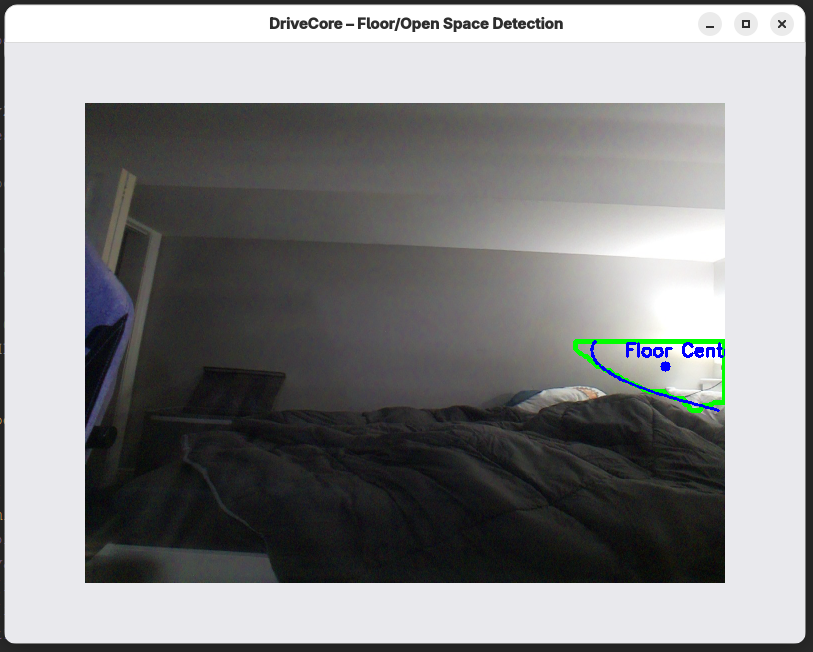
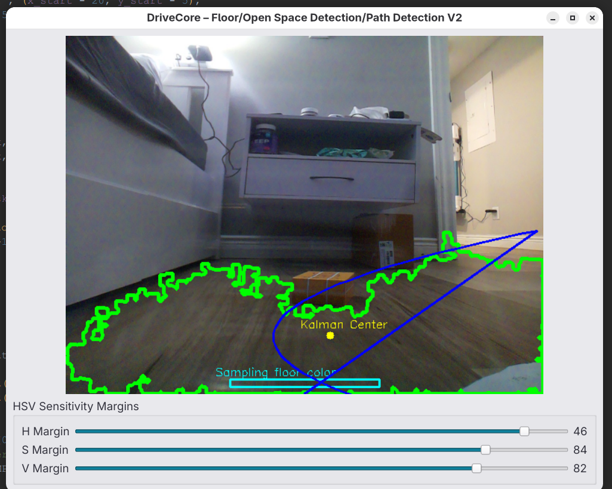
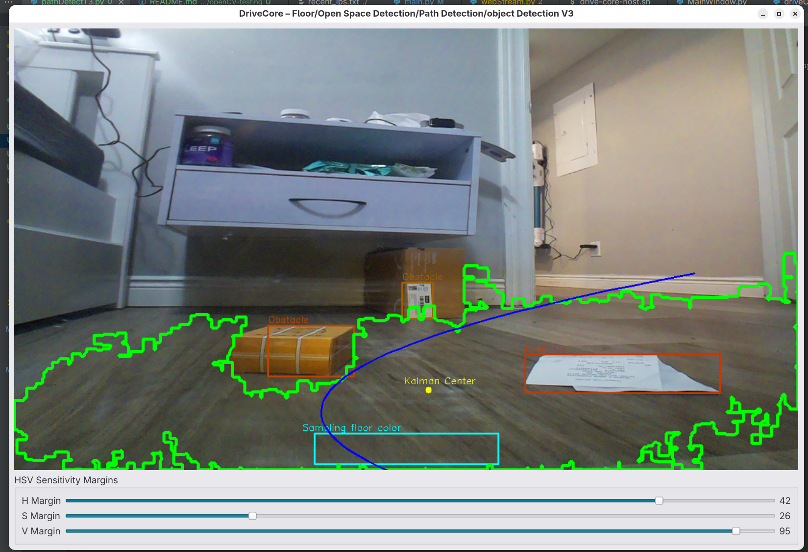
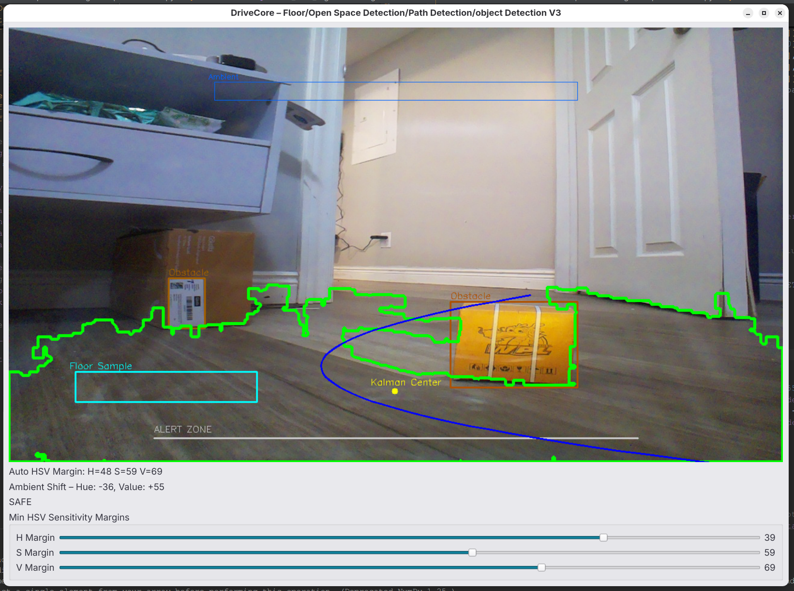

# Open-CV Testing

This folder contains experimental scripts and prototypes for testing various OpenCV-based vision techniques for the DriveCore Project.

The purpose of this directory is to iterate quickly on different ideas including:
- Floor detection
- Obstacle detection
- Simulated depth estimation
- Path planning
- Contour tracking
- Kalman filtering
- Other computer vision utilities

Each script is treated as a standalone experiment or iteration, with its purpose, techniques, and results noted below.

---

## Iteration Notes

### Iteration 01 - `pathDetectT1.py`
- **Goal:** Automatically isolate most driveable flat surfaces, and map a path(curve).
- **Technique:** Sampling using a predefined color array.
- **Result:** Subpar outlining of the floor/surface.
<details>

<summary>GUI Demo 01:</summary>



</details>

### Iteration 02 - `pathDetectT2.py`
- **Goal:** Automatically isolate most driveable flat surfaces, map a path(curve), and sample the floor automatically. 
- **Technique:** Use a box on the lower portion of the screen to sample the HSV values of the floor. Applied Kalman Path Smoothing.
- **Result:** Clean, predictive path useful for motion planning, and addition of HSV sliders.
<details>

<summary>GUI Demo 02:</summary>



</details>

### Iteration 03 - `pathDetectT3.py`
- **Goal:** Detect non-floor objects and estimate proximity.
- **Technique:** Canny edge + contour + ROI + color-coded bounding boxes.
- **Result:** Real-time obstacle alerting with depth-based coloring. Increased resolution to 1280 X 720.
<details>

<summary>GUI Demo 03:</summary>



</details>

### Iteration 04 - `pathDetectT4.py`
- **Goal:** Increase the reliability of object/floor detection, add an object collision warning
- **Technique:** Ambient Light Sampling, Floor Sampling box movement, Alert Line, Auto HSV tuning.
- **Result:** Smart Sampling Box movement, HSV Auto Tune, Reliable obsticle detection.
<details>

<summary>GUI Demo 04:</summary>



</details>

---

## Next Steps

### Iteration 05:
- [ ] Have the Kalman Path be influenced by steering input **TBD**
- [ ] Better edge detection for walls
- [ ] Code Segmenting

---

## How to Run

- Make sure you are in a venv.
- Ensure that the camera or video stream is running

```bash
# Inside the Open-CV Testing folder
python pathDetectTXX.py
```

- **Required packages:**
```bash
pip install opencv-python numpy PySide6
```
