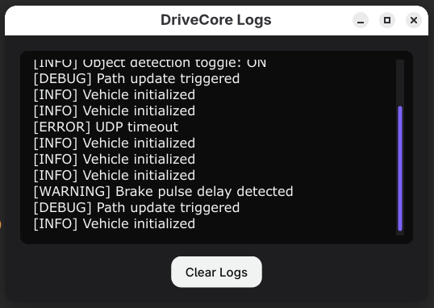
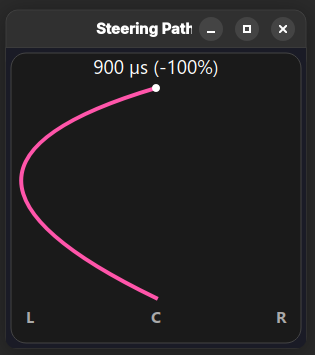

# General GUI Prototypes 

## GUI (v1.2)
---
### Home Page

General Logs GUI (Connection Logs)

#### Features
- A General Logs Widget that can be used to display specific logs
- Scrollable widget
- Clear Button for clearing logs

#### How will this be applied?
- It will be added to the Home Page Next to the Ip input feilds.

[General Logs Code](ver-1-2/generalLogGuiVis.py)

Project Info GUI

#### Features
- Provides:
    - A project description
    - A button that links to the github
    - Shows the most recent release

#### How will this be applied?
- It will be added to the Home Page to replace the about section.

[Project Info Code](ver-1-2/projectInfoGuiVis.py)

### Drive Page

Infotainment GUI

#### Features
- 'P' 'R' 'N' 'D' Visualization
- Alert-Info Widget
- Throttle, Steering, Brake, and Neutral Visualization

#### How will this be applied?
- Widgets will be moved and oriented where the `Keybindings` are.
- `Keybindings` will be moved and minimized vertically to the bottom.

[Vehicle Control Code](ver-1-2/vehicleControlGuiVis.py)

Speedometer GUI

#### Features
- Customizable µs range
- Smooth animation
- Forward and Reverse value Visualization

#### How will this be applied?
- It will replace the Throttle Visualization from [Infotainment GUI](ver-1-2/vehicleControlGuiVis.py)

[Speedometer Code](ver-1-2/speedometerGuiVis.py)

Steer Angle GUI

#### Features
- Customizable µs range
- Smooth animation
- Curve Path Visualization

#### How will this be applied?
- It will replace the Steering Visualization from [Infotainment GUI](ver-1-2/vehicleControlGuiVis.py)

[Steer Angle Code](ver-1-2/steerAngleGuiVis.py)

PRND Selector GUI

#### Features
- An animated PRND selector
- Dynamic animation

#### How will this be applied?
- It will replace the PRND Visualization from [Infotainment GUI](ver-1-2/vehicleControlGuiVis.py)

[PRND Selector Code](ver-1-2/prndGuiVis.py)

General Logs GUI (Alert Logs)

#### Features
- A General Logs Widget that can be used to display specific logs
- Scrollable widget
- Clear Button for clearing logs

#### How will this be applied?
- It will replace the Alert-Info widget from [Infotainment GUI](ver-1-2/vehicleControlGuiVis.py)

[General Logs Code](ver-1-2/generalLogGuiVis.py)

Alert Assist GUI

#### Features
- A red flashing alert to notify an issue
- A button toggle for drive assist (obstacle avoidance)

#### How will this be applied?
- It will be on the bottom right of the Infotainment widgets.

[Alert Assist Code](ver-1-2/alertAssistGuiVis.py)

### Log Page

System Log Page GUI

#### Features
- Shows system logs of the current session
- Different tags for each log 
- Save, clear, or load different logs
- Keyword search area

#### How will this be applied?
- It will be added as a new Log page.

[System Log Page Code](ver-1-2/systemLogPageGuiVis.py)

### Settings Page

Vehicle Calibration GUI

#### Features
- A settings section to set and tune esc and servo µs values.
- Servo values can be adjusted continuously to find the center alignment
- Adjust port values

#### How will this be applied?
- It will be a new settings page section.

[Vehicle Calibration Code](ver-1-2/vehicleCalibrationGuiVis.py)

Settings Description

#### Features
- A settings section that describes the current settings page.
- Text is in markdown format

#### How will this be applied?
- It will be a new settings page section on the right.

[Settings Description Code](ver-1-2/settingsDescriptionGuiVis.py)

