# WPL D-14 
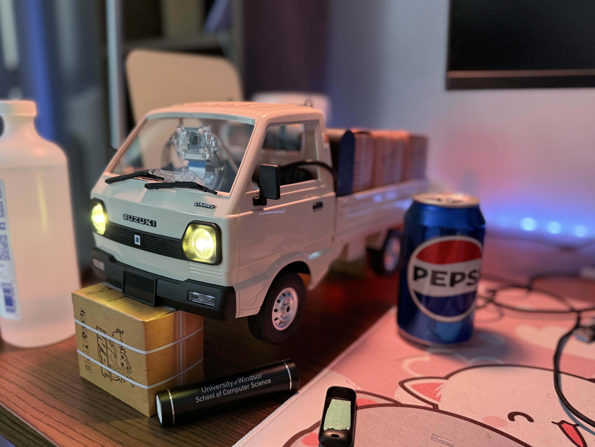

## Currently running Ver 1.2 - *"Control Tuning & UI Foundations"*

---

---
## Features:
### Host:
- Can move forward, backward, and any combination with left or right
- Connection timeout safety stop
- Command queue for reducing input lag
- Ease of acceleration for servo and esc
- 720p video stream using a flask server

### Client:
- Uses pyside6 UI library
- Store recently connected IPs in history
- Video stream
- Inputs using `W` `A` `S` `D`
- On exit, the host "should" stop running
- OpenCV HUD & settings
- UI Foundations for upcomming Ver 1.3

### UI Demo (Ver 1.2):

Home Page

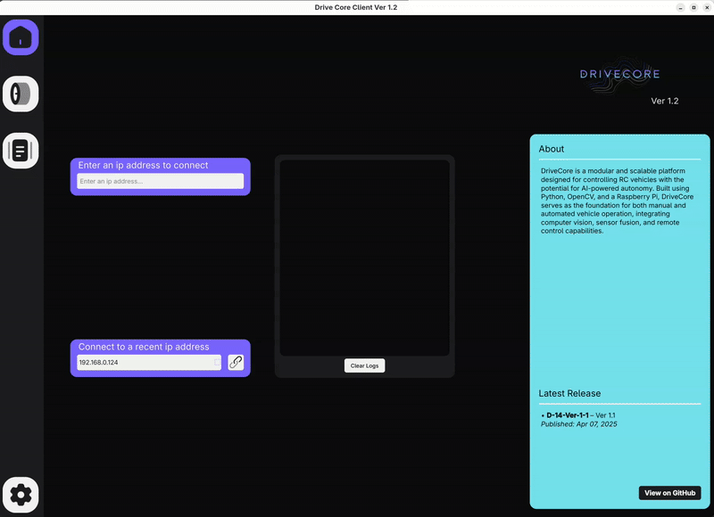

Drive Page

Log Page

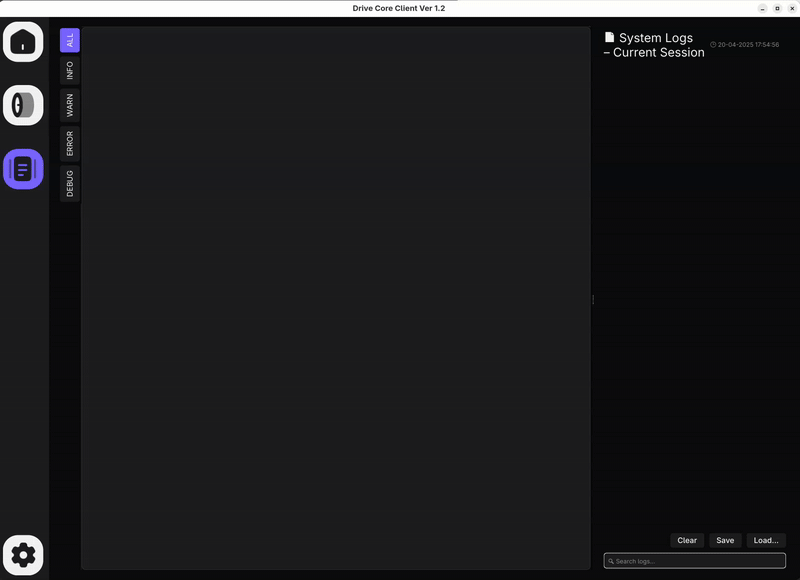

Settings Page

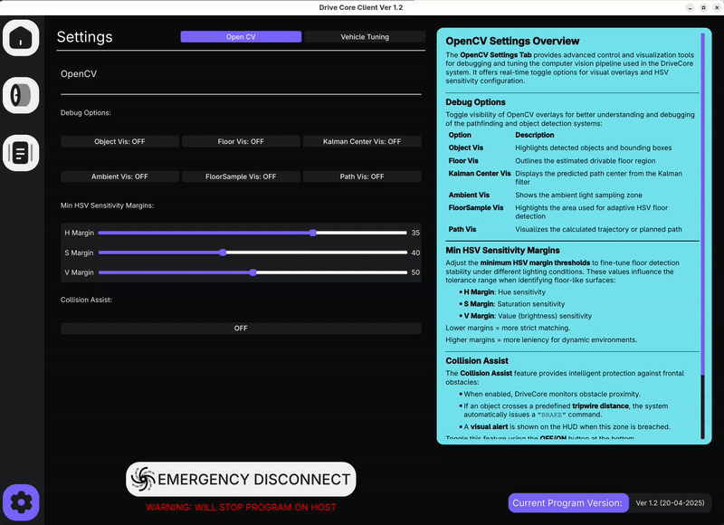

OpenCV Overlay

---

### Change Log

Ver 1.0

#### Ver 1.0

##### Host:
- Can move forward, backward, and any combination with left or right.
- Connection timeout safety stop.
- Command queue for reducing input lag.
- Ease of acceleration for servo and esc.
- 720p video stream using a flask server.

##### Client
- Uses pyside6 UI library.
- Store recently connected IPs in history.
- Video stream.
- Inputs using `W` `A` `S` `D` `SPACE BAR`.
- On exit, the host "should" stop running.

##### UI Demo (Ver 1.0):

Home Page

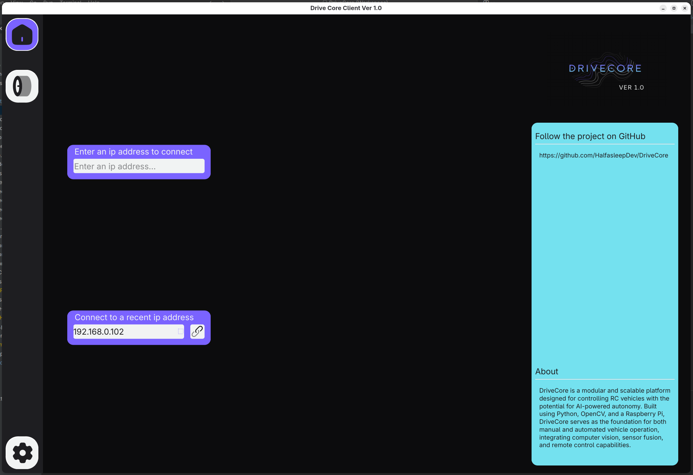

Drive Page

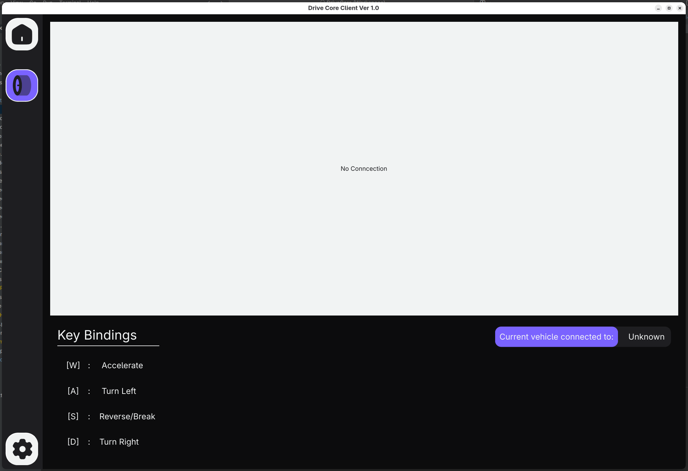

Settings Page

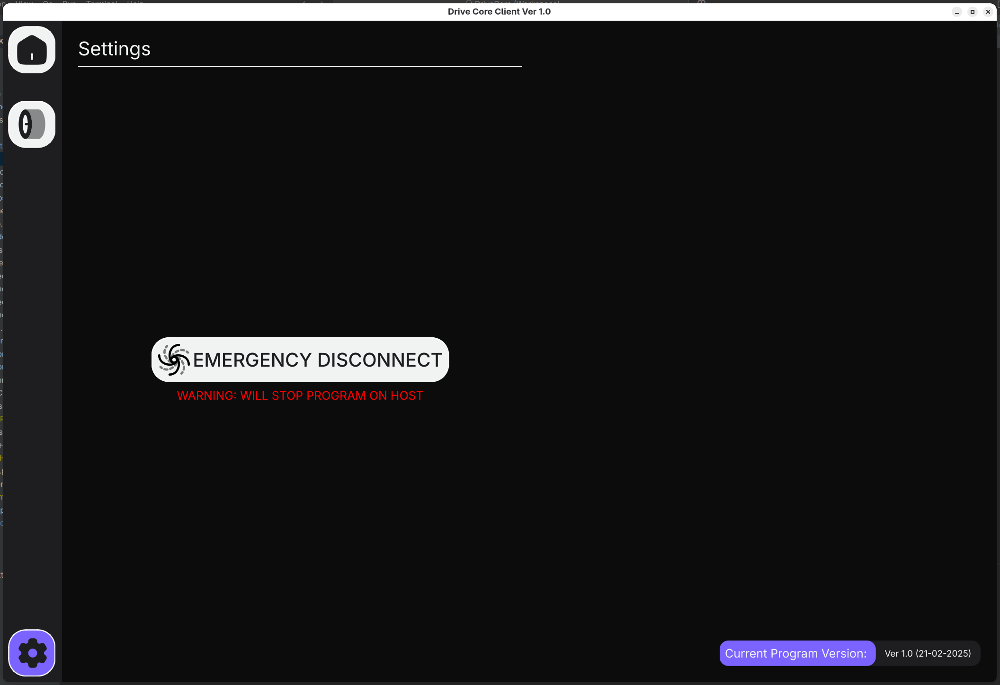

---

Ver 1.1

#### Ver 1.1

##### Host:
- Switched to UDP communication.
- Added a `"BRAKE"` command.
- Basic command spike detection algorithm .
- `"DISCONNECT"` command *potential fix*.

##### Client
- `SPACE BAR` input added for brake.
- [openCV-testing iteration 04](Client-Side/openCV-testing/README.md) implemented & refactored.
- OpenCv settings menu added with overlay toggles.
- Added rough obstacle collision warning/automatic brake.
- Added error popups.
- Added loading cursor for host connection.
- Removed *debug* print statements.

##### UI Demo (Ver 1.1):

Home Page

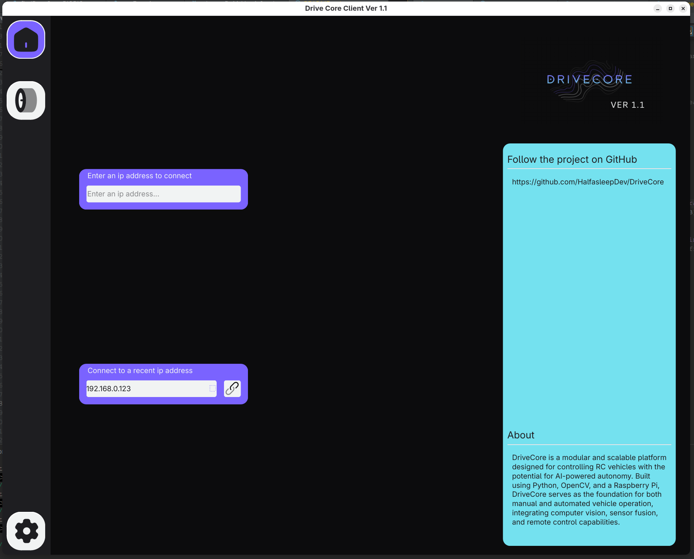

Drive Page

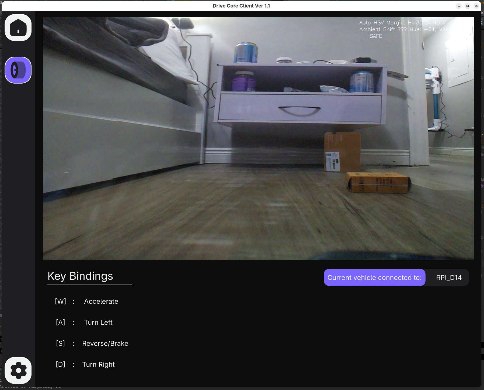

Settings Page

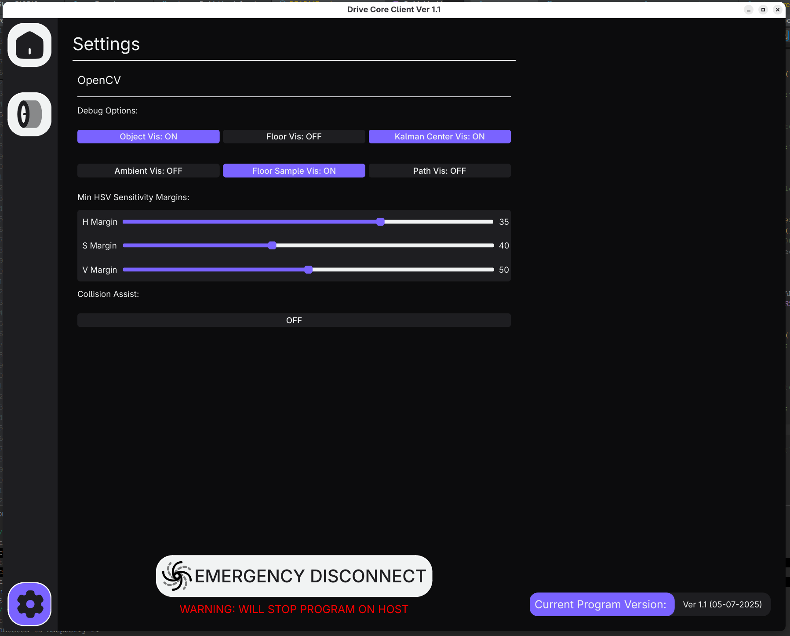

OpenCV Overlay

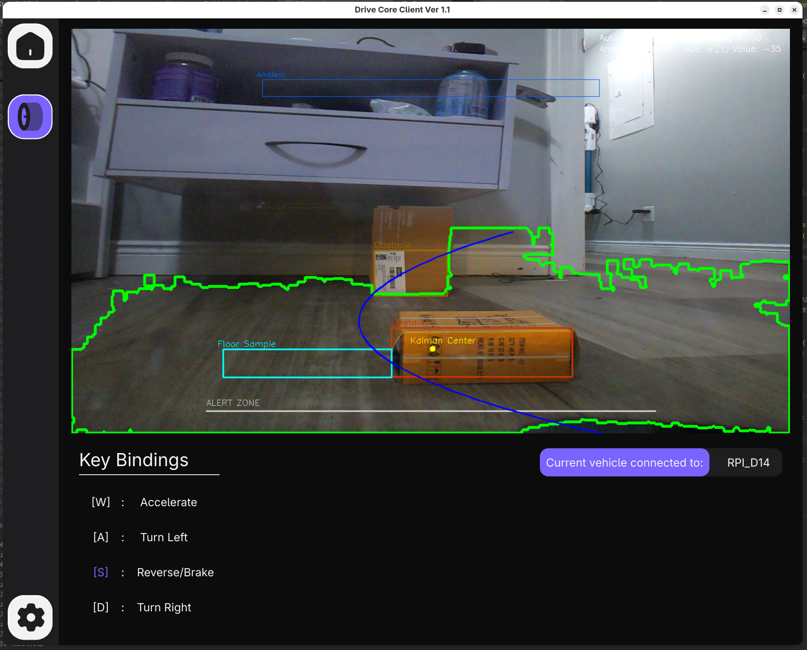

---

Ver 1.2

#### Ver 1.2 - "Control Tuning & UI Foundations"

##### Host:
- No new changes.

##### Client
- Added multiple new UI Elements demonstrated in [ui-prototypes Ver 1.2](Client-Side/ui-prototypes/README.md).
    - `Project Info Widget`
    - `General Logs Widget`
    - `Speedometer Widget`
    - `Steer Angle Widget`
    - `PRND Selector Widget`
    - `DriveAssist Alert Widget`
    - `System Log Page`
    - `Vehicle Calibration Widget`
    - `Settings Description Widget`
- Added a new custom boot screen animation
- General UI Fixes and Tweaks for consistancy. 

##### UI Demo (Ver 1.2):

Home Page

Drive Page

Log Page

Settings Page

OpenCV Overlay

---

---

## Hardware requirements:
- WPL D14 Suzuki Carry - RTR
- Raspberry pi 4
- 8mp raspberry pi cam
- 30A esc
- battery pack
- wifi extender
- led kit (optional)
- Follow the [Electronic Diagram](Diagrams-Concepts/D-14-Electronic-Diagram.pdf)

---

## Current issues:
- [ ] `Emergency Disconnect` does not work properly.
- [x] Sometimes multiple commands are sent at once.
- [x] The servo needs to be re-calibrated.
- [x] The automatic brake creates an info backup

---

## Version Roadmap **(Upcomming)**:

Version 1.3

### Version 1.3 – “Control System & Communication Layer”
- [x] Drive model *(HOST)*
- [x] Client-Host communication & verification
- [x] Acceleration curves *(CLIENT)*
- [x] Vehicle status info *(CLIENT)*
- [x] Restarting connection
- [x] Error messages
- [ ] Application packaging
- [x] Client-Host logging
- [ ] `Emergency Disconnect` system implementation

Version 1.4

### Version 1.4 – “Intelligent Perception Update”
 - [ ] Integrate monoculear depth estimation for floor & obstacle awareness
 - [ ] Use depth to improve obstacle detection & safety logic
 - [ ] Vehicle imu intergration
 - [ ] Vehicle flood light upgrade
 ...

 

Version 1.5

### Version 1.5 – “Autonomy Foundations”
- [ ] Add Kalman-filtered path following (auto-drive down a detected path/auto cruise control)
- [ ] Add basic AI behavior tree or rule-based autonomy modes
...

### Stretch Features(v1.5+) *(TBD)*
- [ ] UI overhall *(Post v1.5)*
- [ ] Raspberry pi based autonomy <-- *If the raspberry pi is too weak, I'll make a new vehicle*
    - [ ] Map tracking
    - [ ] Route mapping
    - [ ] Waypoint Navagation *(TBD)*
    - [ ] Return to Home

Completed Features

- [x] Parking brake **(Ver 1.1)**
- [x] Hardware modifications to cool the raspberry pi
- [X] Upgraded to Raspberry pi 4 (4gb)
- [x] Path detection (opencv) **(Ver 1.1)**
- [x] Reduced input lag **(Ver 1.1)**
- [x] Error popups for critical issues **(Ver 1.1)**
- [x] Framework for steering and max throttle tuning on the `settings` page **(Ver 1.2)**
- [X] UI design consistency **(Ver 1.2)**
- [x] Add UI element foundations for *Ver 1.3* **(Ver 1.2)**
- [x] Upgrade `settings` page **(Ver 1.2)**
- [x] Created the front-end for the `log` page **(Ver 1.2)**

---

UI Concepts

- [UI Preview V 1.0](Diagrams-Concepts/DriveCore-Ver-1-1.pdf)
- [UI Preview V1.2](Diagrams-Concepts/DriveCore-Ver-1-2.pdf)

---

## Client Tested on Arch Linux(Wayland)