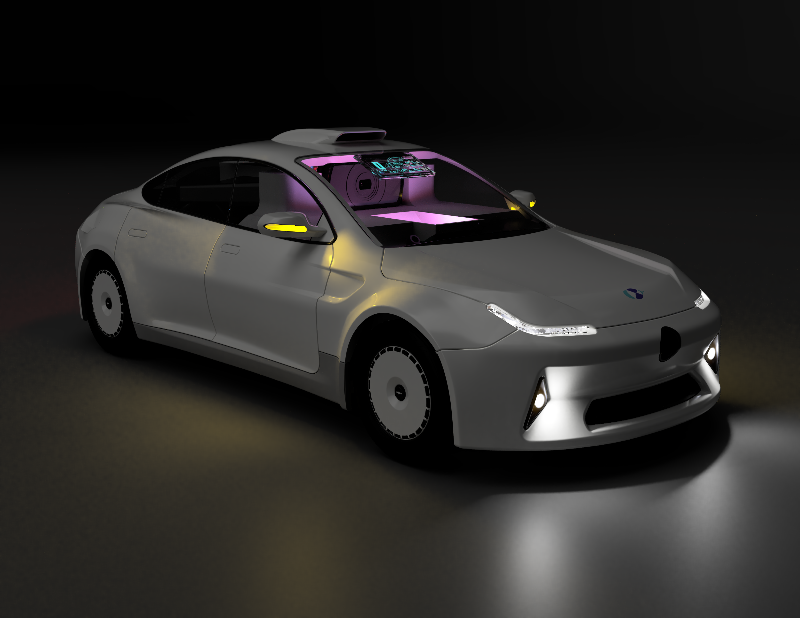
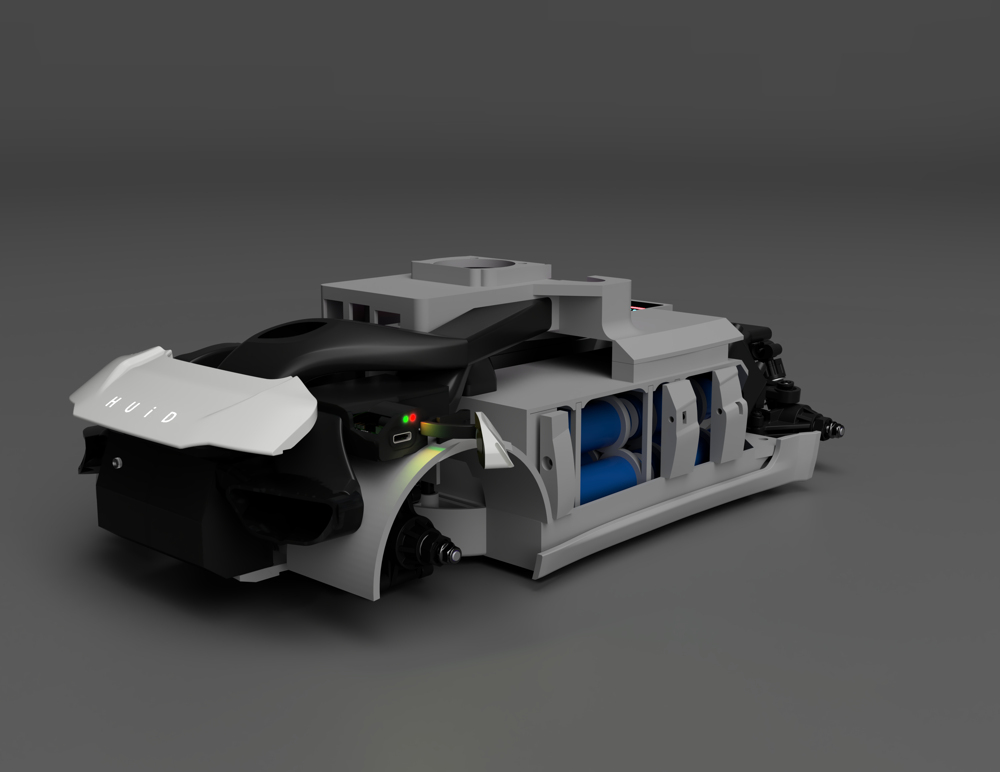

# Probe-33

## A new vehicle platform for DriveCore Version 2.0.0+

---

### External View

### Internal View

---
### Powertrain

- 4WD
- 85A Brushless motor
- 7.4v 7s 2p battery
- USB-C charging
- Smart Power Mux

### Sensors:

- 1080p webcam
- 5mp 720p rear webcam
- Day light sensor
- Water sensor
- Internal battery monitoring temp sensors
- Forwards proximity sensor
- GPS

### Logic:

- Esp32 subsystem control
- Raspberry pi 5 (8gb)

### Cooling:

- 3 intake fans
- 2 exhaust fans

### Electronics:

- Wiper system
- 4 led bars
- 5 individual leds
- OLED HUD for redundency
- 4g data antenna
- Visual battery monitor

### External Features:

- Weatherproof
- Long distance outdoors driving
- 1/10 scale

## Coming soon...